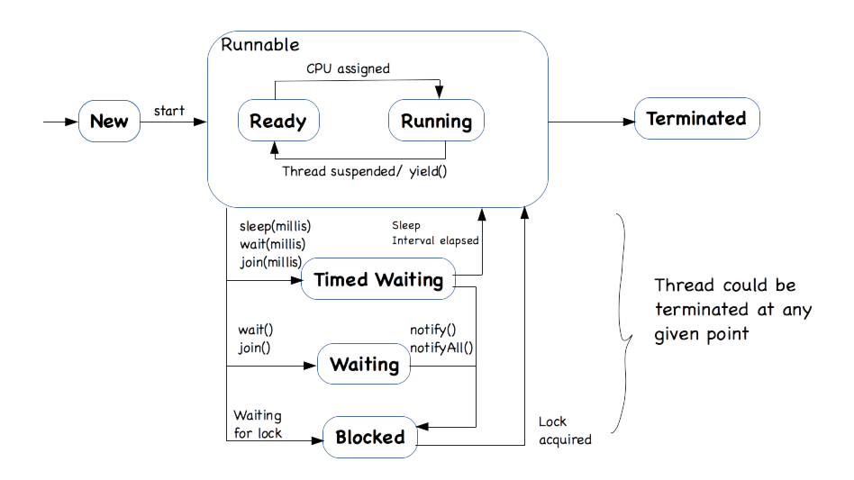

# learning-jmthd
## Threads
- Threads are lightweight processes. A process may have multiple threads running. Multithreading refers to a situation where two or more threads are executing concurrently.
- When there are multiple threads trying to reach out for a single critical
  section, we need to synchronize the threads.
- By Using lock, wait and notify method, we can very
  easily perform synchronization between two or more threads.
- 
- Deamon threads are the threads that don't prevent the JVM from stopping when the main thread 
finishes execution. i.e. generally when a Java application has multiple threads, the JVM won't
exit untill all threads have completed execution. But if all threads are daemon threads, the
JVM will exit as soon as the main thread is done with its execution. Daemon threads can be handy
for use cases like background tasks, garbage collection, token refresh etc.
- Usually when created a thread, we use the Runnable interface (and override the run method). However, the problem with this approach is that the run method of runnable interface can't return a result.
It's return type is void. Hence, when we have a usecase where we want a task to run async on a seperate thread but also need the ability to be able to get some result back from that thread, we need to
use the Callable interface. This interface has a method `call()` which can return data.
